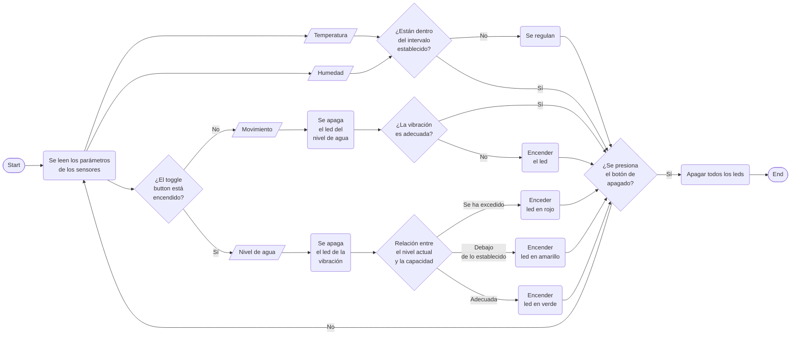

```mermaid
flowchart LR
    A([Start])
    B(Se leen los parámetros
    de los sensores)

    C[/Temperatura/]
    D[/Humedad/]
    E[/Nivel de agua/]
    F[/Movimiento/]

    G{¿Están dentro
    del intervalo
    establecido?}
    H(Se regulan)
    I{¿El toggle 
    button está 
    encendido?}

    N(Se apaga 
    el led del 
    nivel de agua)

    O{¿La vibración
    es adecuada?}
    P(Encender 
    el led)
    J{Relación entre
    el nivel actual
    y la capacidad}
    K(Enceder 
    led en rojo)
    L(Encender 
    led en amarillo)
    M(Encender
    led en verde)
    Q(Se apaga
    el led de la
    vibración)
    
    %% R
    %% S
    %% T
    %% U
    %% V
    %% W
     
    X(Apagar todos los leds)

    Y{¿Se presiona
    el botón de 
    apagado?}
    Z([End])

    A --> B
    B --> C
    B --> D
    B --> I
    I -->|Sí| E
    I -->|No| F
    F --> N
    N --> O
    O -->|No|P

    E --> Q
    Q --> J
    J -->|Se ha excedido| K
    J -->|Debajo 
    de lo establecido| L
    J -->|Adecuada| M


    C --> G
    D --> G

    G -->|No| H

    H --> Y
    G -->|Sí| Y
    O -->|Sí| Y
    P --> Y
    K --> Y 
    L --> Y
    M --> Y

    Y -->|Sí| X
    Y -->|No| B

    X --> Z
    
```
